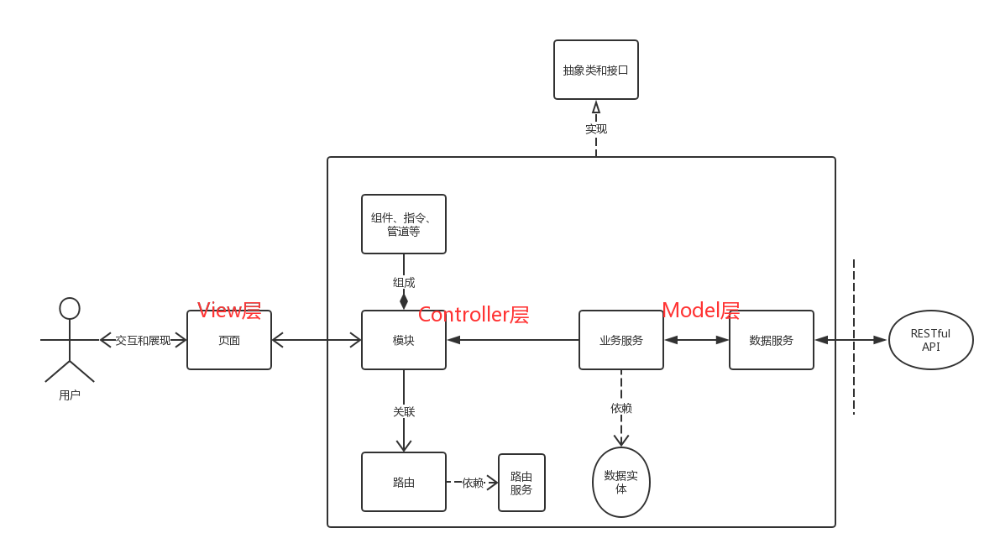
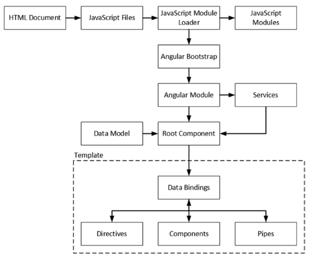

### 架构



* 抽象类和接口：开发过程中抽象出来的变化部分，方便团队实施OOP编程规范。
* 模块：模块(module)是NG中每个独立的功能块，主要分两种：NG模块和自定义模块。它在前端的MVC中属于C。
	* 模块由组件、指令、管道等组成、和路由关联，即路由决定如何展示模块。
		* 组件(component)由HTML、CSS、Typescript组成，是页面组成的基本元素。
		* 指令(directive)的职责是HTML布局。它们塑造或重塑DOM的结构，比如添加、移除或维护这些元素。有自定义指令和内置指令。
		* 管道(pipe)是一种格式化数据的工具，比如格式化成特殊的日期格式，目前我们项目还没有引入。
	* 路由(router)配置什么url展现什么组件，守卫路由实现权限控制的功能。
* 服务和实体：服务(provider)是NG中实现全局通信的单例。我们项目里细分成了数据服务、路由服务、业务服务等。它在前端的MVC中属于M。
	* 数据服务只负责和后端通信。
	* 路由服务只负责提供路由的相关方法。
	* 业务服务负责其他CRUD方法，比如菜单应该如何生成。
	* 数据实体负责提供存储后端数据的容器。

><a href="https://www.angular.cn/docs/ts/latest/guide/setup.html">参考资料</a> 

### 文件结构
```
├─app
│  ├─apps
│  │  ├─chat
│  │  ├─fullcalendar
│  │  ├─mail
│  │  ├─media
│  │  └─social
│  ├─chartlib
│  ├─dashboard
│  ├─dragndrop
│  ├─forms
│  │  ├─editor
│  │  ├─form-tree
│  │  ├─form-upload
│  │  └─form-validation
│  ├─layouts
│  │  ├─admin
│  │  └─auth
│  ├─maps
│  │  ├─map-google
│  │  └─map-leaflet
│  ├─material
│  │  ├─autocomplete
│  │  ├─buttons
│  │  ├─cards
│  │  ├─checkbox
│  │  ├─chips
│  │  ├─dialog
│  │  ├─grid
│  │  ├─input
│  │  ├─lists
│  │  ├─menu
│  │  ├─progress
│  │  ├─radio
│  │  ├─select
│  │  ├─slider
│  │  ├─snackbar
│  │  ├─tabs
│  │  ├─toggle
│  │  ├─toolbar
│  │  └─tooltip
│  ├─pages
│  │  ├─blank
│  │  ├─edit
│  │  ├─invoice
│  │  ├─pricing
│  │  └─timeline
│  ├─session
│  │  ├─error
│  │  ├─forgot
│  │  ├─lockscreen
│  │  ├─not-found
│  │  ├─signin
│  │  └─signup
│  ├─shared
│  │  ├─accordion
│  │  ├─fullscreen
│  │  └─menu-items
│  ├─tables
│  │  ├─data-table
│  │  ├─table-editing
│  │  ├─table-filter
│  │  ├─table-paging
│  │  ├─table-pinning
│  │  ├─table-selection
│  │  └─table-sorting
│  └─widgets
├─assets
│  ├─css
│  ├─data
│  ├─fonts
│  │  ├─data-table
│  │  └─pe
│  │      ├─css
│  │      └─fonts
│  ├─i18n
│  ├─images
│  │  └─unsplash
│  ├─js
│  │  └─pouchdb
│  ├─styles
│  │  ├─kendo
│  │  └─scss
│  │      ├─components
│  │      ├─core
│  │      ├─material
│  │      ├─mixins
│  │      │  └─bi-app
│  │      └─utilities
│  └─vendor
│      └─pace
│          └─themes
│              ├─black
│              ├─blue
│              ├─green
│              ├─orange
│              ├─pink
│              ├─purple
│              ├─red
│              ├─silver
│              ├─white
│              └─yellow
├─components
│  └─loading
├─entities
│  └─enums
├─environments
├─interfaces
└─providers
    ├─auth
    ├─datas
    └─util
```

* app：模块和主程序，现有表单、样式、布局等通用模块。
* assets：资源，包含一些所使用的库、图片、字体等。
* components：组件，页面组成的基本元素。
* entities：实体，提供业务服务所需的数据实体容器。
* environments：运行环境，可以配置生产模式和非生产模式。
* interfaces：抽象类和接口，包含了抽象组件类、抽象数据类、抽象服务类、抽象实体类等。
* providers：单例服务，包含了数据服务、路由服务、业务服务等。

### NG工作流



* HTML Document:应用的入口，一般是index.html。
* JavaScript Files:常规的JS文件，即使用script标签引入的。
* Module Loader:载入NG模块和其他模块的JS组件。
* JavaScript Modules:被打包成可以被模块加载器管理，正确执行的JS文件。
* Angular Bootstrap:配置NG和识别NG模块的TS文件，用来启动应用。
* Angular Module:根模块和附加模块。
* Data Model:提供数据和访问的逻辑。
* Root Component:应用的进入入口，生成动态内容展示给用户。
* Template:通过根组件展现内容的HTML。
* Data Bindings:告诉NG如何动态加载内容，像数据值绑定和用户交互。
* Directives:转换HTML元素从而生成动态内容的类。
* Components:添加内容和特性到应用中的组件。
* Pipes:格式化数据的类。